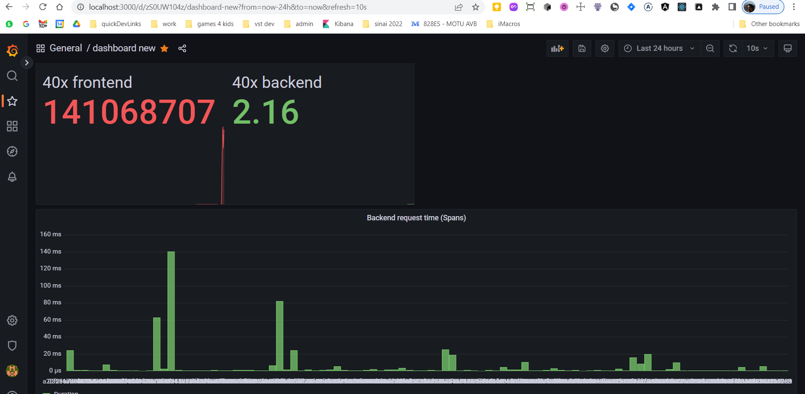

**Note:** For the screenshots, you can store all of your answer images in the `answer-img` directory.

## Verify the monitoring installation

*TODO:* run `kubectl` command to show the running pods and services for all components.  

## Setup the Jaeger and Prometheus source
*TODO:* -  Expose Grafana to the internet and then setup Prometheus as a data source. screenshot after logging into Grafana 

## Create a Basic Dashboard
*TODO:* - Create a dashboard in" Grafana that shows Prometheus as a source. Take a screenshot and include it here.

## Describe SLO/SLI
*TODO:* Describe, in your own words, what the SLIs are, based on an SLO of *monthly uptime* and *request response time*.

SLI for Monthly uptime is a mesurement of container uptime (as observed by a liveness prob) divided by total time in a month to get percentage 
SLI for request response time is a percentage of requests going over a certian defined "good response time" for example 200ms 

## Creating SLI metrics.
TASK5 - It is important to know why we want to measure certain metrics for our customer. Describe in detail 5 metrics to measure these SLIs. 
1. number of failed requests - to remove these from r/s time 
2. total number of requests - to caclulate percentage
3. time for request/response - to calculate r/s average time
4. service uptime in percentage of timeframe (day,months etc)
5. system load - memory/cpu usage

## Create a Dashboard to measure our SLIs
*TODO:* Create a dashboard to measure the uptime of the frontend and backend services We will also want to measure to measure 40x and 50x errors. Create a dashboard that show these values over a 24 hour period and take a screenshot.

## Tracing our Flask App
 *TODO:*  We will create a Jaeger span to measure the processes on the backend. Once you fill in the span, provide a screenshot of it here. Also provide a (screenshot) sample Python file containing a trace and span code used to perform Jaeger traces on the backend service.
 

## Jaeger in Dashboards
 *TODO:* Now that the trace is running, let's add the metric to our current Grafana dashboard. Once this is completed, provide a screenshot of it here.

## Report Error
*TODO:* Using the template below, write a trouble ticket for the developers, to explain the errors that you are seeing (400, 500, latency) and to let them know the file that is causing the issue also include a screenshot of the tracer span to demonstrate how we can user a tracer to locate errors easily.

TROUBLE TICKET

Name: POST to `/star` throw 500 error

Date:14/4/23 at 20:45

Subject: Can't POST to `/star` endpoint

Affected Area: backend

Severity: Major 

Description: the `/star` endpoint returns 500 error, jaeger span screenshot is attached, the file responsbile for this endpoint is app.py line 61, possibly mongo DB is not configured

## Creating SLIs and SLOs
*TODO:* We want to create an SLO guaranteeing that our application has a 99.95% uptime per month. Name four SLIs that you would use to measure the success of this SLO.

To measure the success of achieving the SLO for 99.95% application uptime per month, the following SLIs would be shown:

 - Percentage of uptime (errors)
 - Average use of CPU and memory consumption (saturation)
 - Percentage of fast response times (eg less than 250ms) (performance).
 - The number of failing requests in a day (quality of service).
## Building KPIs for our plan
*TODO*: Now that we have our SLIs and SLOs, create a list of 2-3 KPIs to accurately measure these metrics as well as a description of why those KPIs were chosen. We will make a dashboard for this, but first write them down here.

 1. Percentage of uptime - important as it is the  first measure that shows our service SLO is hurt
    - uptime of frontend service
    - uptime of backend service
 2. Average resource use - too high means we are running too close to infra limits
    - CPU usage of backend/frontend
    - memeory usage of backend/frontend
 3. Number of failing requests per day - good marker for QoS
    - 404 errors in frontend - broken links?
    - 500 errors in frontend - errors in processing of forms/other user input?
    - 500 errros in backend - errors in business logic & infra services

## Final Dashboard
*TODO*: Create a Dashboard containing graphs that capture all the metrics of your KPIs and adequately representing your SLIs and SLOs. Include a screenshot of the dashboard here, and write a text description of what graphs are represented in the dashboard.  

The dashboard includes the followins graphs
top row - uptime of backend & frontend services in percentage 
middle row - resource use - on the left CPU usage in percentage of 1 single core, on the right memory uasage in MBs -both for both frontend and backend services
bottom row - 404 & 500 errors for both services on the left and spans from jager on the right